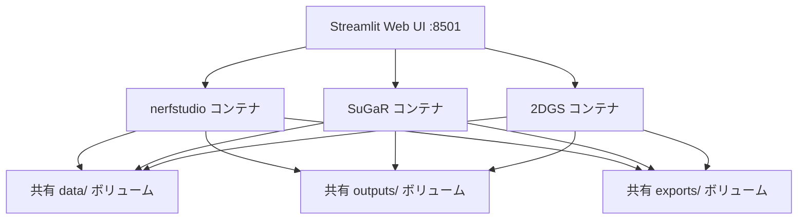

# SuGaR & 2DGS 統合実装プラン

## 概要

SuGaR（メッシュ抽出）と2DGS（高品質レンダリング）をDocker Composeマルチコンテナ構成で既存プロジェクトに追加。統一Web UIから全フレームワークを操作可能にする。

---

## アーキテクチャ



**パイプライン:**
1. **データ前処理** (nerfstudio) → COLMAP → `data/nerfstudio/<project>/`
2. **学習** (選択したフレームワーク) → `outputs/<project>/`
3. **エクスポート** → PLY/GLB → `exports/<project>/`

---

## Proposed Changes

### ディレクトリ構成変更

```
nerfstudio_projects/
├── docker-compose.yml          # [MODIFY] 3サービスに拡張
├── app.py                      # [MODIFY] 統合Web UI
├── containers/                 # [NEW] 各フレームワークのDockerfile
│   ├── nerfstudio/Dockerfile
│   ├── sugar/Dockerfile
│   └── 2dgs/Dockerfile
├── scripts/
│   ├── sugar_train.py          # [NEW] SuGaR学習スクリプト
│   ├── 2dgs_train.py           # [NEW] 2DGS学習スクリプト
│   └── convert_ply_to_glb.py   # [NEW] PLY→GLB変換スクリプト
├── data/                       # 共有データ
├── outputs/                    # 共有出力
└── exports/                    # 共有エクスポート
```

---

### 1. Docker構成

#### [NEW] [containers/nerfstudio/Dockerfile](file:///c:/Users/muna1/nerfstudio_projects/containers/nerfstudio/Dockerfile)

現在のDockerfileを移動。変更なし。

#### [NEW] [containers/sugar/Dockerfile](file:///c:/Users/muna1/nerfstudio_projects/containers/sugar/Dockerfile)

```dockerfile
FROM nvidia/cuda:11.8.0-devel-ubuntu22.04
# Python 3.9 + PyTorch 2.0 + CUDA 11.8
# SuGaR + gaussian-splatting submodule
# trimesh + open3d (PLY→GLB変換用)
```

- SuGaRリポジトリ (`Anttwo/SuGaR`) をクローン
- CUDA 11.8 + PyTorch 2.0 + PyTorch3D
- 3DGS学習 → SuGaRメッシュ抽出のパイプライン

#### [NEW] [containers/2dgs/Dockerfile](file:///c:/Users/muna1/nerfstudio_projects/containers/2dgs/Dockerfile)

```dockerfile
FROM nvidia/cuda:11.8.0-devel-ubuntu22.04
# Python 3.8 + PyTorch 2.0 + CUDA 11.8
# 2d-gaussian-splatting + diff-surfel-rasterization
# open3d + trimesh
```

- 2DGSリポジトリ (`hbb1/2d-gaussian-splatting`) をクローン
- diff-surfel-rasterization サブモジュールビルド

---

### 2. Docker Compose

#### [MODIFY] [docker-compose.yml](file:///c:/Users/muna1/nerfstudio_projects/docker-compose.yml)

3つのサービスに拡張。共有ボリュームで接続：

```yaml
services:
  nerfstudio:
    build: containers/nerfstudio
    # ...既存設定
  sugar:
    build: containers/sugar
    volumes: [共有data/outputs/exports]
    deploy: [GPU]
  2dgs:
    build: containers/2dgs
    volumes: [共有data/outputs/exports]
    deploy: [GPU]
```

---

### 3. Web UI

#### [MODIFY] [app.py](file:///c:/Users/muna1/nerfstudio_projects/app.py)

**主な変更:**

- **フレームワーク選択**: nerfstudio / SuGaR / 2DGS を切り替え可能
- **SuGaRパイプライン**: 3DGS事前学習 → SuGaRメッシュ抽出 → テクスチャ付きメッシュ
- **2DGSパイプライン**: 直接学習 → 高品質PLYエクスポート
- **エクスポートページ拡張**:
  - PLY → GLB 変換ボタン
  - SuperSplat リンク（PLYダウンロード後にドラッグ＆ドロップ）
  - PlayCanvas リンク（GLBダウンロード後にドラッグ＆ドロップ）
- **nerfstudioモデル選択拡張**: `splatfacto`, `nerfacto`, `neus-facto`, `instant-ngp` 等

---

### 4. ヘルパースクリプト

#### [NEW] [scripts/convert_ply_to_glb.py](file:///c:/Users/muna1/nerfstudio_projects/scripts/convert_ply_to_glb.py)

`trimesh` を使用してPLYメッシュをGLB形式に変換。

#### [NEW] [scripts/sugar_train.py](file:///c:/Users/muna1/nerfstudio_projects/scripts/sugar_train.py)

SuGaRの学習→メッシュ抽出パイプラインを自動化。

#### [NEW] [scripts/2dgs_train.py](file:///c:/Users/muna1/nerfstudio_projects/scripts/2dgs_train.py)

2DGSの学習→エクスポートパイプラインを自動化。

---

## ビルド時間の見積もり

| コンテナ | 初回ビルド時間 | イメージサイズ |
|---|---|---|
| nerfstudio | 既存 | ~15GB |
| SuGaR | ~15-20分 | ~12GB |
| 2DGS | ~10-15分 | ~10GB |

> [!WARNING]
> 3コンテナ合計で約37GB のディスク容量が必要です。

---

## Verification Plan

1. `docker compose build` で全コンテナがビルドされることを確認
2. Web UIからSuGaRパイプライン（3DGS→メッシュ抽出）が動作することを確認
3. Web UIから2DGS学習→エクスポートが動作することを確認
4. PLY→GLB変換が正常に動作することを確認
5. エクスポートしたPLYがSuperSplatで開けることを確認
